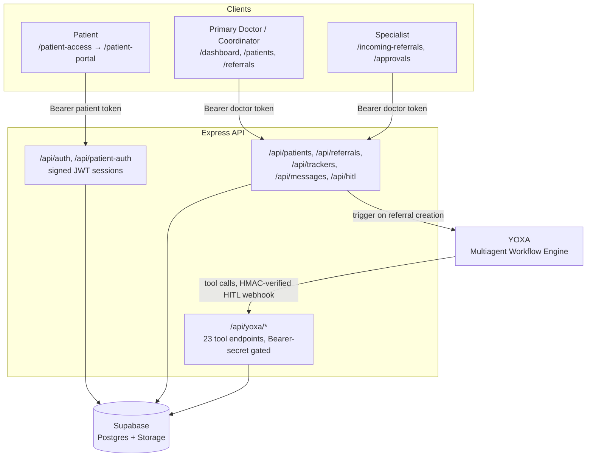

<div align="center">

# MedicoTabs

### Referral Lifecycle EHR for Primary Doctors, Specialists & Coordinators

**The Referral That Never Goes Dark.**

<br />


<br />

[Deployment Guide](DEPLOYMENT.md) · [YOXA Integration](backend/YOXA_INTEGRATION_GUIDE.md) · [Connector Reference](backend/openapi-connectors/README.md) · [Render Deploy](backend/RENDER_DEPLOYMENT.md)

**Live:** [App](https://medico-tabs.vercel.app/) · [API](https://medicotabs.onrender.com) · [YOXA Workflow](https://yoxa.ai/builder/e886a6ae-3e2d-48c0-aa3b-cbf39f94e7c0)

</div>

---

## Overview

MedicoTabs manages the full lifecycle of a specialist referral — from a primary doctor sending it, through specialist acceptance, insurance coverage verification, scheduling, and sign-off — with every step visible on a **Flight Tracker**.

Routine stages of that lifecycle are automated by **YOXA**, an external multiagent workflow engine: routing the referral, alerting the specialist, exchanging documents, verifying coverage, booking appointments, and archiving the record. A human stays in the loop wherever it matters through **HITL (Human-In-The-Loop) approvals**.

---

## Features

| Feature | Description |
|:--------|:------------|
| **Flight Tracker** | 5-stage visual tracker (`Create & Route → Acceptance & Records → Coverage Verification → Scheduling & Attendance → Completion & Archive`) with agent action history per stage |
| **Coverage Verification, targeted** | The Coverage Verification stage only exists for referrals marked as an **advanced treatment/operation** — general checkups skip it entirely. When it runs, the tracker shows **Covered** or **Cannot be claimed** |
| **Referral system** | Primary doctors create referrals; specialists see unclaimed referrals matching their specialty plus ones already assigned to them; accept/decline with reasons delivered as messages |
| **YOXA multiagent workflow** | 23 tool endpoints covering routing, alerts, document exchange, coverage, scheduling, and archival — triggered automatically on referral creation |
| **HITL approvals** | Doctor/coordinator sign-off requests raised mid-workflow, answered from the app, resolved back to YOXA |
| **Document management** | Upload, download, and delete patient documents in Supabase Storage, scoped by role |
| **Two-way messaging** | Referral-scoped messaging between primary doctors, specialists, and coordinators |
| **Patient Portal** | A separate, low-privilege identity for patients — referral status, appointment details, coverage outcome, care journey, and document downloads, without ever touching a doctor's session |
| **Role-scoped dashboard** | Live stats and recent activity, scoped to the signed-in doctor rather than the whole system |

---

## Tech Stack

<table>
<tr>
<th width="50%">Frontend</th>
<th width="50%">Backend</th>
</tr>
<tr>
<td valign="top">

| Layer | Technology |
|:------|:-----------|
| Framework | React 18 + TypeScript |
| Build | Vite 7 |
| Routing | React Router 7 |
| Styling | Tailwind CSS 3 (neumorphic design system) |
| Animation | Framer Motion |
| HTTP | Axios |
| Icons | Lucide React |

</td>
<td valign="top">

| Layer | Technology |
|:------|:-----------|
| Runtime | Node.js + Express 4 |
| Database | Supabase (Postgres) |
| File storage | Supabase Storage |
| Auth | Signed JWT sessions (`jsonwebtoken`) — separate token spaces for doctors and patients |
| Uploads | Multer |
| PDF generation | PDFKit (referral summaries, patient records) |
| Workflow | YOXA multiagent workflow engine |

</td>
</tr>
</table>

---

## Architecture



| Principle | Detail |
|:----------|:-------|
| **Two identity spaces** | Doctor sessions and patient sessions are signed separately — a patient can never reach a doctor route, or vice versa |
| **Scoped by role** | Primary doctors/coordinators see their own patients and referrals; specialists see referrals assigned to them plus unclaimed ones matching their specialty |
| **Workflow-driven, human-checked** | YOXA automates routine steps; anything requiring judgment surfaces as a HITL approval |
| **Fail visibly, not silently** | If the YOXA trigger fails, the referral is still created and the failure is surfaced in the UI rather than lost |

---

## Roles & Screens

| Route | Role | Purpose |
|:------|:-----|:--------|
| `/dashboard` | Primary Doctor · Coordinator · Specialist | Role-scoped stats, recent activity, incoming referrals |
| `/patients`, `/patients/new`, `/patients/:id` | Primary Doctor · Coordinator | Patient records, documents, Flight Tracker |
| `/referrals`, `/referrals/new` | Primary Doctor · Coordinator | Create and track outgoing referrals |
| `/incoming-referrals` | Specialist | Accept/decline referrals, review shared documents |
| `/messages` | All doctor roles | Referral-scoped two-way messaging |
| `/approvals` | All doctor roles | Respond to HITL approval requests |
| `/doctors` | Primary Doctor · Coordinator | Doctor directory |
| `/notifications`, `/settings` | All doctor roles | Alerts, profile, notification preferences |
| `/patient-access` → `/patient-portal` | Patient | Referral ID + DOB login, referral status, care journey, documents |

---

## Quick Start

**Requirements:** Node.js 18+ · a Supabase project · a YOXA workflow deployment (optional for local UI work)

```bash
# Terminal 1 — Backend
cd backend
npm install
cp .env.example .env      # set SUPABASE_URL, SUPABASE_SERVICE_ROLE_KEY, JWT_SECRET, YOXA_* vars
npm run dev

# Terminal 2 — Frontend
cd frontend
npm install
npm run dev
```

| Service | URL |
|:--------|:----|
| App | http://localhost:3000 |
| API | http://localhost:5000 |
| Health | http://localhost:5000/health |

---

## Deployment

| Service | Host | Directory | Start | Live URL |
|:--------|:-----|:----------|:------|:---------|
| Frontend | [Vercel](https://vercel.com) | `frontend` | `npm run build` → serve `dist/` | [medico-tabs.vercel.app](https://medico-tabs.vercel.app/) |
| Backend | [Render](https://render.com) (`backend/render.yaml`) | `backend` | `npm start` | [medicotabs.onrender.com](https://medicotabs.onrender.com) |
| Database & Storage | [Supabase](https://supabase.com) | — | — | — |
| Workflow engine | [YOXA](https://yoxa.ai) | — | — | [Workflow builder](https://yoxa.ai/builder/e886a6ae-3e2d-48c0-aa3b-cbf39f94e7c0) |

See [DEPLOYMENT.md](DEPLOYMENT.md) for the full Supabase schema and step-by-step deploy instructions, and [backend/RENDER_DEPLOYMENT.md](backend/RENDER_DEPLOYMENT.md) for the backend specifically.

---

## Configuration

### Backend (`backend/.env`)

| Variable | Required | Description |
|:---------|:--------:|:------------|
| `SUPABASE_URL` | Yes | Supabase project URL |
| `SUPABASE_SERVICE_ROLE_KEY` | Yes | Service-role key (backend only — never expose to the client) |
| `JWT_SECRET` | Yes | Signs doctor and patient session tokens |
| `YOXA_TRIGGER_URL` | For workflow automation | YOXA public workflow trigger endpoint |
| `YOXA_DEPLOYMENT_SECRET` | For workflow automation | Sent as `X-Yoxa-Deployment-Secret` on trigger |
| `YOXA_DEPLOYMENT_ID` | For workflow automation | YOXA deployment identifier |
| `YOXA_API_BASE` | For workflow automation | YOXA API base URL |
| `YOXA_HITL_WEBHOOK_SIGNING_SECRET` | For HITL | Verifies inbound `/api/hitl/webhook` HMAC signature |
| `YOXA_HITL_RESPONSE_SECRET` | For HITL | Sent when responding to a HITL request |
| `YOXA_TOOLS_API_KEY` | Recommended | Bearer secret YOXA must send on every `/api/yoxa/*` tool call — leave unset only until you've configured the matching token in the YOXA platform UI |
| `ALLOWED_ORIGINS` | No | Comma-separated CORS allowlist beyond localhost |

### Frontend (`frontend/.env`)

| Variable | Required | Default | Description |
|:---------|:--------:|:--------|:------------|
| `VITE_BACKEND_API_URL` | No | `http://localhost:5000` | Base URL the frontend calls for all API requests |

---

## Project Structure

```
MedicoTabs/
├── frontend/                       React + TypeScript + Vite
│   └── src/
│       ├── pages/                    Dashboard · Patients · Referrals · Approvals · PatientPortal · ...
│       ├── components/
│       │   ├── FlightTracker/          Stage-by-stage tracker visualization
│       │   ├── Layout/                 Sidebar · Header
│       │   └── ui/                     PromptModal · LoadError · InlineAlert
│       ├── contexts/                  AuthContext · PatientAuthContext · ToastContext
│       └── services/                  api.ts (doctor) · patientPortalApi.ts (patient)
├── backend/                        Express API
│   ├── src/
│   │   ├── routes/                    auth · patients · referrals · trackers · hitl · yoxa · ...
│   │   ├── middleware/                doctorAuth · patientAuth · anyAuth · yoxaAuth
│   │   ├── services/                  yoxaService.js (trigger workflow, HITL responses)
│   │   └── config/                    database.js (Supabase) · yoxa.js
│   └── openapi-connectors/          23 YOXA tool connector specs
└── DEPLOYMENT.md                   Supabase schema + deploy steps
```

---

## Documentation

| Document | Contents |
|:---------|:---------|
| [DEPLOYMENT.md](DEPLOYMENT.md) | Supabase schema, environment setup, deploy steps |
| [backend/YOXA_INTEGRATION_GUIDE.md](backend/YOXA_INTEGRATION_GUIDE.md) | How the YOXA workflow integration is wired |
| [backend/openapi-connectors/README.md](backend/openapi-connectors/README.md) | All 23 tool connectors, upload steps, security notes |
| [backend/RENDER_DEPLOYMENT.md](backend/RENDER_DEPLOYMENT.md) | Backend deploy on Render |

---

<div align="center">

**A referral goes out. A specialist accepts it. Coverage clears. The patient sees every step.**

</div>
